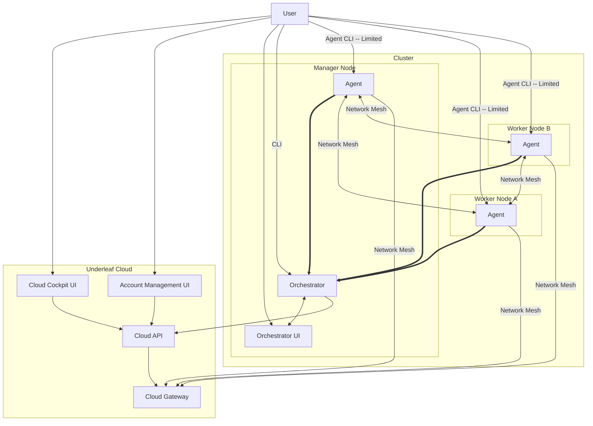

# Underleaf V2

Underleaf V1 itself went through a large number of fundamental refactors, so why V2 now? Because during the previous changes, we were improving to fit a certain product shape. V2 marks the start of a new product shape.

V1: Large, complex microservice cloud backend; fragmented, multi-agent client; cloud connection required
- this resulted in a ton of split-brain bugs and made everything much more complex for very little gain

V2: Truly local, unified management service; small, simple, flexible client; cloud API/UI is for billing/admin and network gateways

## What Stays

We keep the repo-backed manifest model: a `deploy gh:<user>/<repo>`-style command is meant to stay the flagship command. **Not implemented yet** — see [ROADMAP.md](ROADMAP.md) track 2. (`ufctl` isn't a real binary in this codebase today; the current CLIs are `orcli` and `ufagent`/`ufagentd`.)

Cloud Gateway Features: we keep our network mesh model.

Users don't pay to remove artificial paywalls, they pay for usage on cost-usage features (cloud gateway)

## What Leaves

Orchestration in the cloud

Long running connections to the cloud.

Microservices

## What's New

Premium Cloud Cockpit UI: the local Orchestrator UI, API and CLI interfaces are fully powered. The Cockpit UI is for advanced users that have more than one cluster or want to pay for advanced remote access features.

## Roadmap

See [ROADMAP.md](ROADMAP.md) for the current assessment of what's built vs. outstanding, and the planned sequencing to MVP.

## Architecture



### Manager Node
#### Orchestrator

Orchestrator is the main brain of the system. It orchestrates all of the Underleaf automations necessary to make the Underleaf manifest model work. This is the main control entry point for a cluster. One Orchestrator per Cluster.

| Info | Value |
| ---- | ----- |
| Language | Golang |
| Architecture | Hexagonal Domain Driven Design App |
| Storage | Sqlite3 |

Interfaces

| Protocol | Purpose | Location |
| -------- | ------- | -------- |
| gRPC | Unix socket management API for CLI | `unix:/tmp/undf-orch.sock` |
| gRPC | Agent-Orchestrator communication | `:50100` |
| http | REST API for the Orchestrator UI and integrations (JSON only, no static assets served) | `http://localhost:9090/api/v1/` |

#### Orchestrator UI

Operator UI for managing your cluster. A standalone Vite dev server/SPA build — it is **not** served by the orchestrator process itself, it just calls the REST API above.

| Info | Value |
| ---- | ----- |
| Language | TypeScript |
| Framework | Vite + React |
| Datastore | TanStack Query |

Interfaces

| Protocol | Purpose | Location |
| -------- | ------- | -------- |
| http | UI dev server (`npm run dev`) | `http://localhost:5183/` |

No production static-hosting path is wired up for this UI yet (unlike Account UI, which nginx serves — see below); it's dev-server-only today.

### All Nodes

#### Agent

| Info | Value |
| ---- | ----- |
| Language | Golang |
| Architecture | CLI + Daemon |
| Storage | Sqlite3 |

Interfaces

| Protocol | Purpose | Location |
| -------- | ------- | -------- |
| gRPC | Unix socket management API for CLI | `unix:/tmp/undf-agent.sock` |
| gRPC | Agent-Orchestrator + Agent-Agent communication | `:50101` |
| http | Local REST API (currently just `/health`) | `http://localhost:9091/api/v1/` |


### Underleaf Cloud

#### Cloud API

| Info | Value |
| ---- | ----- |
| Language | Python |
| Framework | FastAPI |
| Architecture | Hexagonal Domain Driven Design App |
| Storage | Postgres |

Interfaces

| Protocol | Purpose | Location |
| -------- | ------- | -------- |
| http | REST API, internal (behind nginx) | `http://cloud_api:8080/api/v2/cloud/` (`http://localhost:8080/...` outside Docker) |
| https | REST API, external (via nginx, Bearer token or mTLS) | `https://underleafapp.com/api/v2/cloud/` |

#### Conn Worker

Implements the Cloud Gateway: brokers and multiplexes tunnels between Agents and gateway clients.

| Info | Value |
| ---- | ----- |
| Language | Golang |
| Storage | Redis |

Interfaces

| Protocol | Purpose | Location |
| -------- | ------- | -------- |
| gRPC | Agent connection/tunnel management | `:50102` |
| http | REST API for Cloud API management/data display, internal | `http://conn_worker:9070/api/v2/connections/` |
| http(s) | Northbound: gateway client access, per-stream subdomain (via nginx) | `https://<stream-id>.gw.underleafapp.com` → `conn_worker:9020` |
| tcp+mTLS | Southbound: node/agent tunnel establishment (via nginx stream proxy) | nginx `:19021` → `conn_worker:9021` |

See [cloud/conn_worker/README.md](cloud/conn_worker/README.md) for the detailed connection/tunnel architecture and data model.

#### Account Management UI

Cloud-hosted account/billing management UI.

| Info | Value |
| ---- | ----- |
| Language | TypeScript |
| Framework | Vite + React |
| Datastore | TanStack Query |

Interfaces

| Protocol | Purpose | Location |
| -------- | ------- | -------- |
| http | UI dev server (`npm run dev`) | `http://localhost:5181/` |
| https | Production static build, served by nginx | `https://underleafapp.com/` |

#### Cloud Cockpit UI

Premium multi-cluster management UI for advanced users. **Unimplemented** — currently just the unmodified `create-vite` scaffold (no `api/`, `datastore/`, `components/`, or `pages/` layers yet, unlike the two UIs above).

| Info | Value |
| ---- | ----- |
| Language | TypeScript |
| Framework | Vite + React |

Interfaces

| Protocol | Purpose | Location |
| -------- | ------- | -------- |
| http | UI dev server (`npm run dev`) | `http://localhost:5182/` |

## Directory Structure

```
README.md (You are here)
Makefile (root Makefile: make run / make stop everything)
go.mod (single Go module covering edge/ and cloud/conn_worker)
RFDs/ (design docs -- key user flows, connection architecture, UI gold standard)
configs/local/ (per-service YAML config for local dev + docker-compose)
certs/ (local dev TLS material, gitignored)
e2e_testing/ (pytest-based end-to-end tests against the running stack)
shared/ (Go: types, clients, migrator, and utils shared by orchestrator/agent/conn_worker)
scripts/ (dev helper scripts, e.g. kill_by_port.sh)
cloud/
    |-Procfile, Makefile (overmind targets for cloud services)
    |-cloud_api/       (Python/FastAPI: Cloud API, pyproject.toml, src/cloud_api)
    |-conn_worker/     (Go: Cloud Gateway connection/tunnel broker)
    |-account_ui/      (TypeScript/Vite/React: Account Management UI)
    |-cockpit_ui/      (TypeScript/Vite/React: Cloud Cockpit UI)
    |-docker/          (Dockerfiles for cloud_api, conn_worker, nginx gateway config)
edge/
    |-Procfile, Makefile (overmind targets for edge services)
    |-orchestrator/    (Go: orchestrator server, CLI (orcli), migrate binary; uses the root go.mod)
    |-agent/           (Go: ufagent CLI + ufagentd daemon)
    |-orchestrator_ui/ (TypeScript/Vite/React: Orchestrator UI)
```

## Development

Each of `edge/` and `cloud/` is a [Procfile](https://devcenter.heroku.com/articles/procfile)-driven service group, run locally via [`overmind`](https://github.com/DarthSim/overmind).

```bash
# from repo root: build edge binaries (dev-mode), then start both edge + cloud groups
make run
# tear everything down (overmind, node, conn-worker processes)
make stop
```

- `edge/Procfile` runs `orch-server`, `ufagentd`, and the Orchestrator UI (`npm run dev`, port 5183).
- `cloud/Procfile` runs `cloud_api` (`make run` inside `cloud/cloud_api`), `conn_worker`, and the Account (`5181`) and Cockpit (`5182`) UIs.
- Per-group targets exist too: `cd edge && make run` / `cd cloud && make run`, or run a single service, e.g. `cd cloud && make run-cloud-api`.
- `make build-orc` / `cd edge && make build` compiles the Go binaries (`orcli`, `orch-server`, `migrate`, `ufagent`, `ufagentd`) into `edge/bin`.
- `docker-compose.yaml` + `configs/local/*.yaml` stand up a more production-like Cloud stack (nginx gateway, cloud_api, conn_worker, postgres, redis) as containers instead of local processes.
- End-to-end tests live in [`e2e_testing/`](e2e_testing/README.md) (pytest) and expect the stack above to be running.
- UI code (`account_ui`, `cockpit_ui`, `orchestrator_ui`) should follow [RFDs/UI-STANDARD.md](RFDs/UI-STANDARD.md) — `edge/orchestrator_ui` is the reference implementation.
- See [ROADMAP.md](ROADMAP.md) for what's built, what's outstanding, and planned sequencing to MVP.

## Tagging Policy

Main branch is `develop`

### Edge

On push to develop:
- build new "develop" release
    - build new binaries (ufagent, ufagentd and orcli)
    - overwrite "develop" release with new release
    - add binaries to this new release
- build new "develop" docker image
    - build new Docker image tagged `underleaf:develop`
    - push to `ghcr.io` (overwrite existing if any)

On push to SemVer tag:
- build new release for tag:
    - build new binaries (ufagent, ufagentd and orcli)
    - create new "[0-9].[0-9].[0-9]" release
    - overwrite "latest" release with new release
    - add binaries to these new releases
- build new "latest", "[0-9]", "[0-9].[0-9]", "[0.9].[0-9][0-9]" docker images
    - for example, if we push the tag `2.3.40`, we would build:
        - `underleaf:latest`
        - `underleaf:2`
        - `underleaf:2.3`
        - `underleaf:2.3.40`
    - push to `ghcr.io` (overwrite existing if any)
