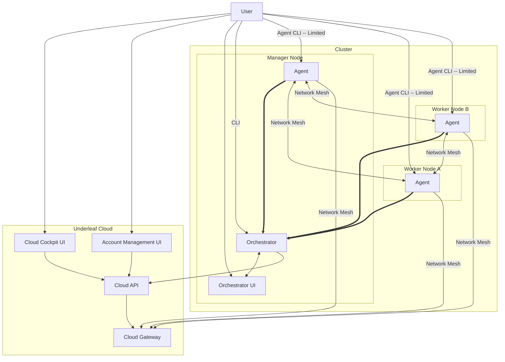

# Underleaf V2

Underleaf V1 itself went through a large number of fundamental refactors, so why V2 now? Because during the previous changes, we were improving to fit a certain product shape. V2 marks the start of a new product shape.

V1: Large, complex microervice cloud backend; fragmented, multi-agent client; cloud-connection required
- this resulted is a ton of split brain bugs and made everything much more complex for very little gain

V2: Truly local, unified management servicy; small simpe flexible client; cloud API/UI is for billing/admin and network gateways

## What Stays

We keep the repo-backed manifest model: `ufctl deploy gh:<user>/<repo>` is still the flagship command.

Cloud Gateway Features: we keep our network mesh model.

Users don't pay to remove artificial paywalls, they pay for usage on cost-usage features (cloud gateway)

## What Leaves

Orchestration in the cloud

Long running connections to the cloud.

Microservices

## What's New

Premium Cloud Cockpit UI: the local Orchestrator UI, API and CLI interfaces are fully powered. The Cockpit UI is for advanced users that have more than one cluster or want to pay for advanced remote accesss features.

## Architecture



### Manager Node
#### Orchestrator

Orchestrator is the main brain of the system. It orchestratos all of the Underleaf automations necessary to make the Underleaf manifest model work. This is the main control entry point for a cluster. One Orchestrator per Cluster.

| Info | Value |
| ---- | ----- |
| Language | Golang |
| Architecture | Hexagonal Domain Driven Design App |
| Storage | Sqlite3 |

Interfaces


| Protocol | Purpose | Location |
| -------- | ------- | -------- |
| gRPC | Unix socket management API for CLI | unix:/tmp/undf-orch.sock |
| gRPC | Agent-Orchestrator communication | :50100
| http | REST API for UI and integrations | http://0.0.0.0:9090/api

#### Orchestrator UI

Operator UI for managing your cluster

| Info | Value |
| ---- | ----- |
| Language | TypeScript |
| Framework | Vite + React |
| Datastore | TanStack |

Interfaces

| Protocol | Purpose | Location |
| -------- | ------- | -------- |
| http | UI browser access | http://0.0.0.0:9090/ui/ |


### All Nodes

#### Agent

| Info | Value |
| ---- | ----- |
| Language | Rust |
| Architecture | CLI + Daemon |
| Storage | Sqllite |

Interfaces

| Protocol | Purpose | Location |
| -------- | ------- | -------- |
| gRPC | Unix socket management API for CLI |  unix:/tmp/undf-agent.sock |
| gRPC | Agent-Orchestrator + Agent-Agent communication | :50101


### Underleaf Cloud

#### Cloud API


| Info | Value |
| ---- | ----- |
| Language | Python |
| Framework | FastAPI |
| Architecture | Hexagonal Domain Driven Design App |
| Storage | Postgres |

Interfaces

| Protocol | Purpose | Location |
| -------- | ------- | -------- |
| http | UI browser access | http://0.0.0.0:9091/api/ |


#### Account Management UI

Account Managenent UI

| Info | Value |
| ---- | ----- |
| Language | TypeScript |
| Framework | Vite + React |
| Datastore | TanStack |

Interfaces

| Protocol | Purpose | Location |
| -------- | ------- | -------- |
| http | UI browser access | http://0.0.0.0:9091/ui/ |


#### Cloud Cockpit UI

Account Managenent UI

| Info | Value |
| ---- | ----- |
| Language | TypeScript |
| Framework | Vite + React |
| Datastore | TanStack |

Interfaces

| Protocol | Purpose | Location |
| -------- | ------- | -------- |
| http | UI browser access | http://0.0.0.0:9092/ui/ |

## Directory Structure

```
README.md (You are here)
Makefile (root Makefile for the project)
cloud
    |-cloud_api
        |-pyprojject.toml
        |-src
            |-cloud_api
    |-management_ui
        |-package.json
    |-cockpit_ui
        |-package.json
edge
    |-orchestrator
        |- go.mod