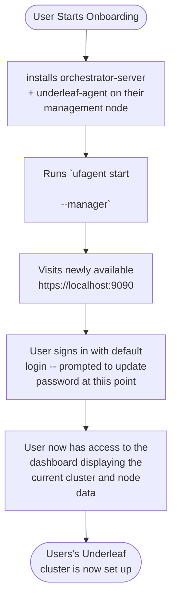

# RFD-1: Key User Flows

Onboarding

```mermaid
flowchart TD
    U([User Starts Onboarding]) --> s100[installs orchestrator-server
    + underleaf-agent on their
    management node]

    s100 --> s200[Runs `ufagent start

    --manager`]

    s200 --> s300[Visits newly available
    https://localhost:9090]

    s300 --> s400[User signs in with default
    login -- prompted to update
    password at thiis point]

    s400 --> s500[User now has access to the
    dashboard displaying the
    current cluster and node
    data]

    s500 --> END([Users's Underleaf 
    cluster is now set up])
```