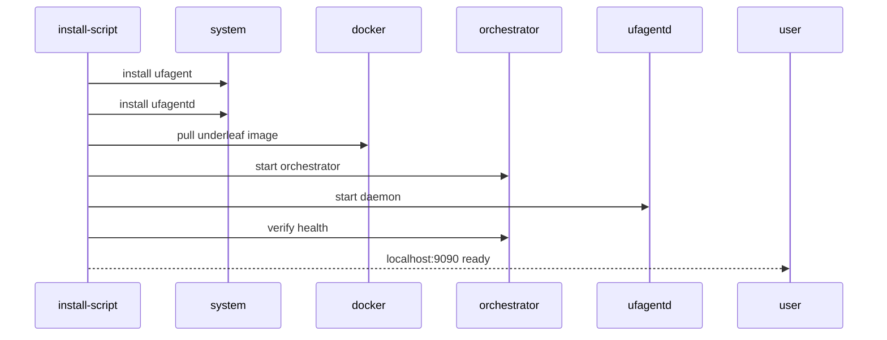

# RFD-1: Key User Flows

### Onboarding

User flow

```mermaid
flowchart TD

U([User Starts Onboarding])

U --> A[Install Underleaf]

A --> B[Underleaf configures this machine]

B --> C[Open local dashboard]

C --> D[Deploy first application]

D --> E([Underleaf is now useful])
```

System flow

```mermaid
sequenceDiagram

install-script->>system: install ufagent
install-script->>system: install ufagentd
install-script->>docker: pull underleaf image
install-script->>orchestrator: start orchestrator
install-script->>ufagentd: start daemon
install-script->>orchestrator: verify health
install-script-->>user: localhost:9090 ready
```