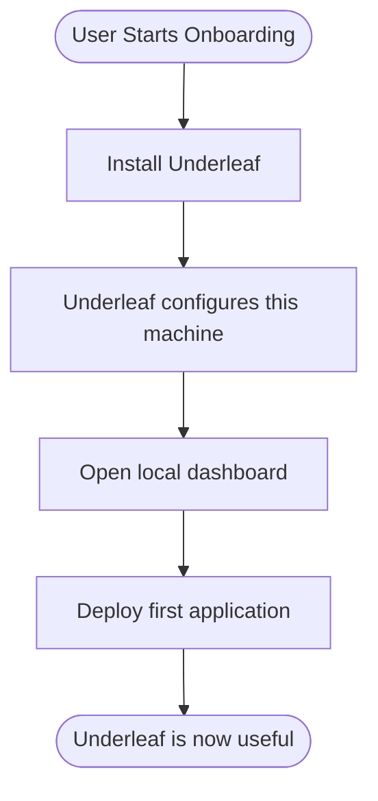
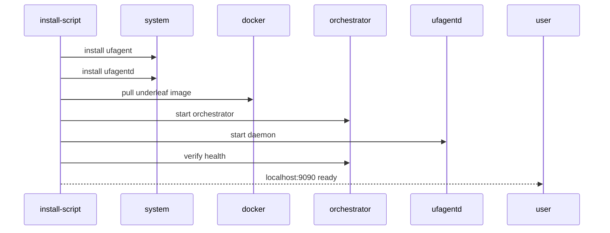
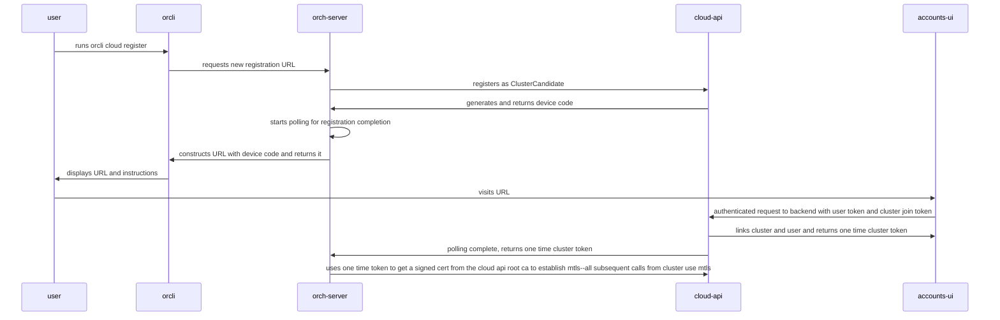

# RFD-1: Key User Flows

## Onboarding

User flow



System flow



## Cluster Registration

User flow

```mermaid
flowchart TD
    U0([User Starts Cluster Registration])
    U0 --> A[User runs orcli cloud register]
    A --> B[orcli displays register URL (includes registration token)]
    B --> C[User visits URL]
    C --> D[User signs in/creates an account]
    D --> E[Confirmation panel appears for linking cluster to account]
    E --> F[User clicks Confirm]
    G --> H[User get redirected to clusters/{cluster_id}]
```

System Sequence (assumes brand new user, simpler case is existing user)


