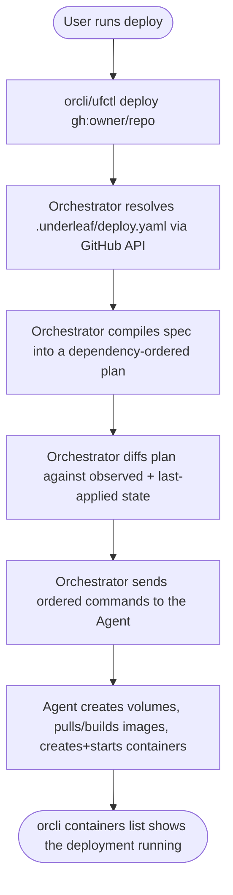
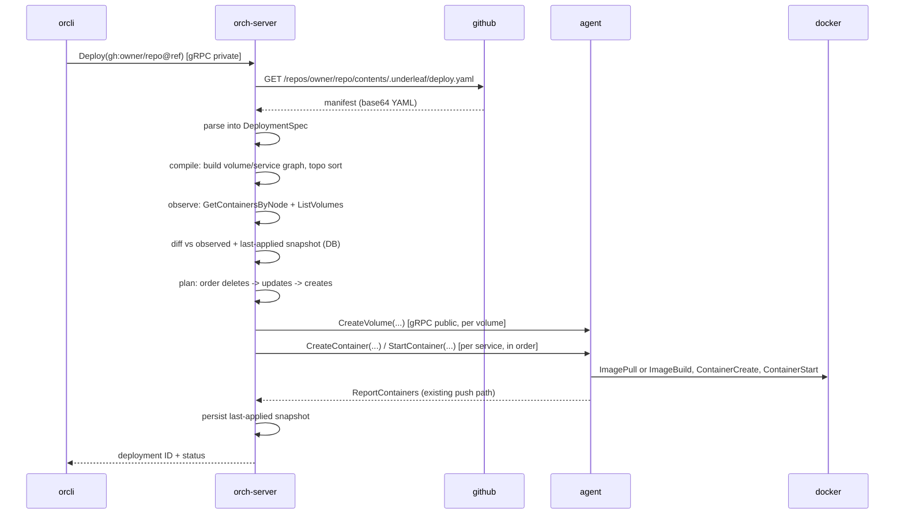
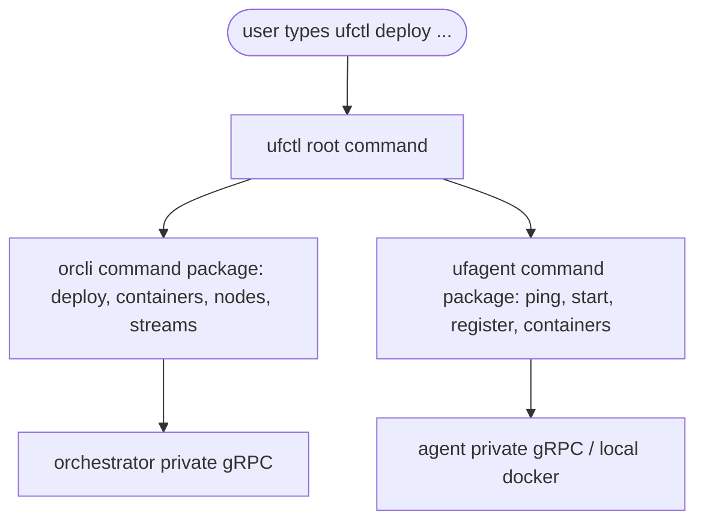

# RFD 3: Manifest & Deploy

This RFD formalizes Track 2 of [ROADMAP.md](../ROADMAP.md). It documents decisions rather than inventing them from scratch: the manifest format was already shipped in a prior (zero-user) version of Underleaf and is already checked into real, public repositories (`ambientlabscomputing/n8n`, `ambientlabscomputing/hello-world`) as `.underleaf/deploy.yaml`. This document is the compatibility contract for that file, plus the new v2-native architecture for resolving, reconciling, and executing it.

## Manifest format

A deployable repo carries a `.underleaf/deploy.yaml` at its root:

```yaml
version: "1"
name: n8n
slug: n8n
services:
  - name: n8n
    image: n8nio/n8n:latest        # exactly one of image/build
    # build:
    #   context: "."
    #   dockerfile: Dockerfile
    #   args: {}
    ports: ["5678:5678"]
    expose:
      port: 5678
      hostname: ""                  # optional; gateway exposure is track 3/4
    environment: {NODE_ENV: production}
    networks: [name]                # optional; parsed, not yet acted on (see below)
    volumes: ["n8n_data:/home/node/.n8n"]
networks:
  - name: <string>
    driver: <string, optional>
volumes:
  - name: n8n_data
```

`image:` and `build:` are both first-class, already-shipped cases — a service must declare exactly one. `build:` is the "deploy straight from source" path: the orchestrator resolves the repo's tarball and hands it to the agent to build.

Fields intentionally **not** modeled in v2 (present in the prior implementation's fuller JSON form, tied to a multi-tenant control plane / capability registry that has no v2 equivalent): `org_id`, `capability_requirements`, multi-server `targeting`. v2 assumes a single agent node, matching the existing hardcoded agent address. These fields are simply absent from the schema — a manifest that doesn't use them needs no changes.

**Deferred: Docker network creation.** `networks:` is parsed and stored, but Track 2 does not create or connect Docker networks — every deployment's containers run on the default bridge. This mirrors what actually shipped in the prior implementation's real execution path, not a new gap. Revisit once a manifest actually needs cross-container networking beyond shared volumes.

## Deploying a manifest

User flow



System flow



## Build-from-source execution (the `build:` case)

```mermaid
sequenceDiagram
orch-server->>orch-server: service has build: block
orch-server->>agent: CreateContainer(source: {archive_url, dockerfile, context, args})
agent->>github: GET codeload.github.com/owner/repo/tar.gz/ref
github-->>agent: gzipped tarball
agent->>agent: extract (strip top-level dir, reject path traversal/absolute symlinks, 500MB cap)
agent->>docker: ImageBuild(context, dockerfile, args) -> tagged image
agent->>docker: ContainerCreate(image) with hardened HostConfig
agent->>docker: ContainerStart
agent->>agent: 3s stability check; on crash, tail last 20 log lines
agent-->>orch-server: ReportContainers
```

Container hardening applied to every created container regardless of `image:`/`build:` origin: all capabilities dropped except `NET_BIND_SERVICE`, read-only root filesystem with a writable `tmpfs` at `/tmp`, a fixed resource ceiling, and `unless-stopped` restart policy. These are not manifest-configurable in Track 2.

## The `ufctl` command gateway

`orcli` (orchestrator-facing) and `ufagent` (agent-facing) remain the real, independently developed and tested CLIs. `ufctl` is a thin composition binary with no command logic of its own — it mounts both packages' cobra command trees under one root so a user only has to remember one command name, matching what the public n8n/hello-world docs already tell people to run.



`orcli` and `ufagent` keep shipping as standalone binaries, unchanged — `ufctl` only adds a second `main.go` that imports and mounts the same `AddCommands(root)` functions.

## Reconciliation ownership

Compile/observe/diff/plan/execute-ordering lives entirely in the **Orchestrator**, which already owns Node/Container state as the source of truth (`GetContainersByNode`, the container repository). The Agent stays a thin, stateless-per-call Docker executor reached over its existing `AgentPublic` gRPC service — it does not compute plans, diff state, or persist a local last-applied snapshot. This is a deliberate departure from the prior implementation (which pushed the full pipeline to each edge server); it fits v2's existing architecture better and lets last-applied state live in the Orchestrator's own database instead of a JSON file on each agent's disk.
