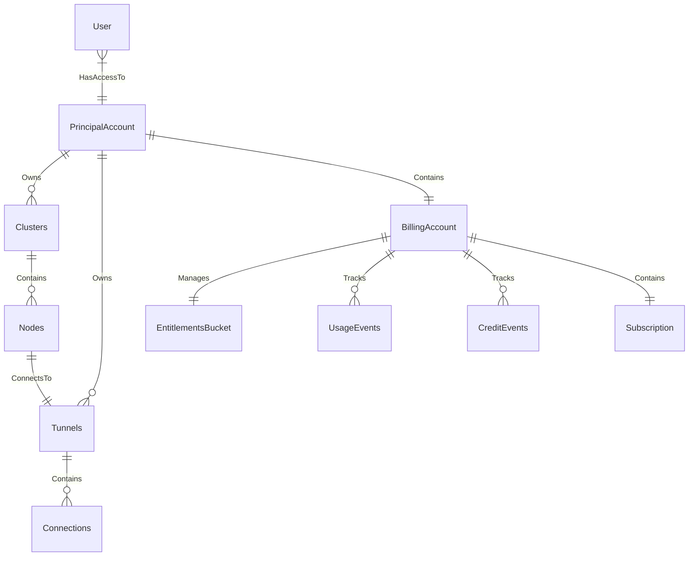

# Cloud API

## Data Model



| Info | Value |
| ---- | ----- |
| Language | Python |
| Framework | FastAPI |
| Storage | Postgres |

| Protocol | Purpose | Location |
| -------- | ------- | -------- |
| http | REST API | `http://0.0.0.0:9091/api/` |

## Running locally

```bash
make run
```

Normally run as part of the cloud process group (`cd cloud && make run`, or `make run-cloud-api`) — see the [root README](../../README.md#development). Config is read from `configs/local/cloud_api.yaml` (or `UNDERLEAF_CONFIG` when containerized via [docker-compose.yaml](../../docker-compose.yaml)). Schema migrations live under `alembic/`.

