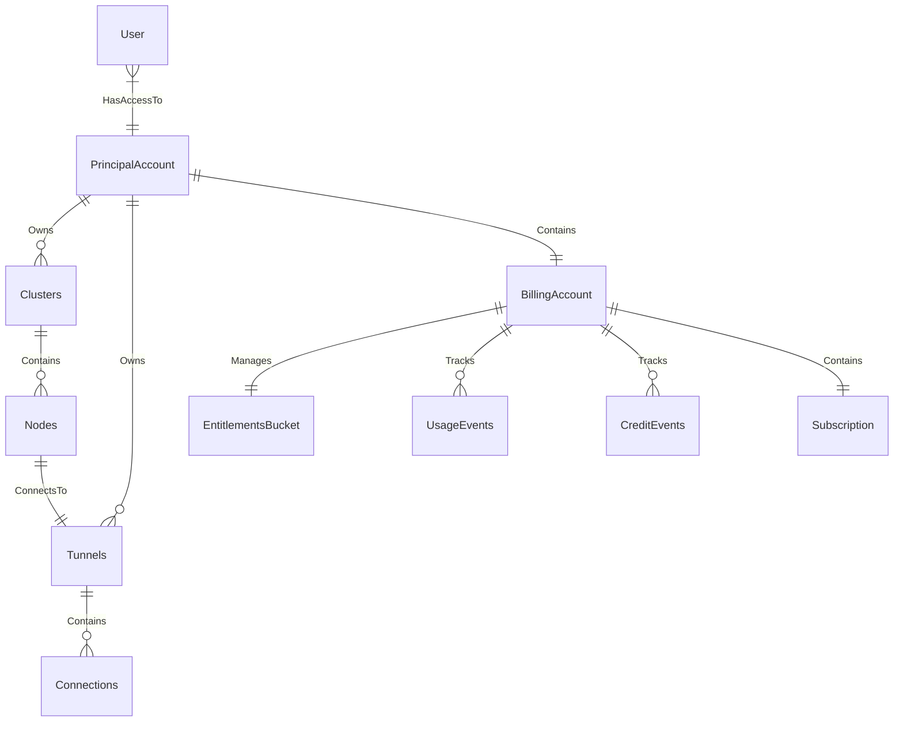

# Cloud API

## Data Model

```mermaid
erDiagram
    User }|--|| PrincipalAccount : HasAccessTo
    PrincipalAccount ||--o{ Clusters : Owns
    PrincipalAccount ||--o{ Tunnels : Owns
    Tunnels ||--o{ Connections : Contains
    PrincipalAccount ||--|| BillingAccount : Contains
    BillingAccount ||--|| EntitlementsBucket : Manages
    BillingAccount ||--o{ UsageEvents : Tracks
    BillingAccount ||--o{ CreditEvents : Tracks
    Clusters ||--o{ Nodes : Contains
    Nodes ||--|| Tunnels : ConnectsTo
    BillingAccount ||--|| Subscription : Contains
```
