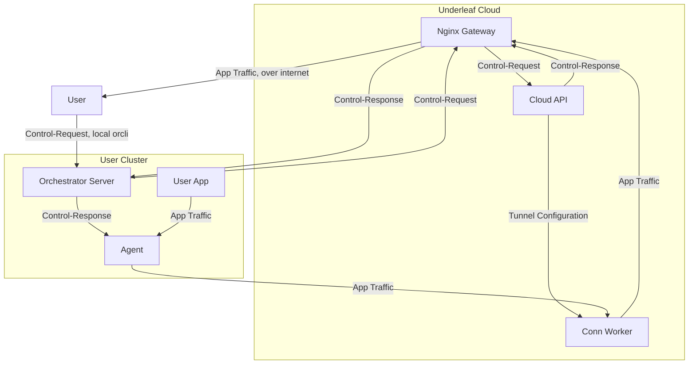
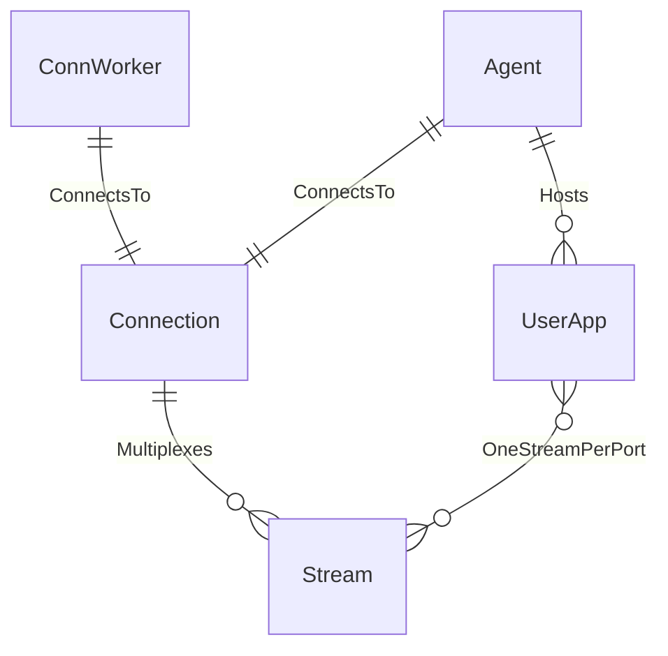

# Conn Worker

## Architecture



## API

### gRPC

This is the real integration surface: Cloud API talks to Conn Worker directly over gRPC (see `cloud_api/lib/conn_worker_client`) to create/list/inspect/close tunnels — there is no separate REST management API in front of it, and none is planned. Cloud API exposes its own REST CRUD for connections/streams to its own clients (`interface/connections/`, `interface/streams/` in `cloud_api`); Conn Worker itself only serves `/health` over HTTP (see the table below) and is not expected to grow a REST surface of its own.

Also used by the agent to establish and manage its connection with the Conn Worker (yamux-multiplexed) — see `interface/grpc/*.proto` and [connection_manager.go](service/connection_manager.go). Actual service:

```proto
service ConnectionWorker {
    // Connections
    rpc CreateConnection(CreateConnectionRequest) returns (Connection);
    rpc GetConnection(GetConnectionRequest) returns (Connection);
    rpc TerminateConnection(TerminateConnectionRequest) returns (google.protobuf.Empty);
    rpc ListConnections(google.protobuf.Empty) returns (stream Connection);

    // Streams
    rpc NewStream(NewStreamRequest) returns (Stream);
    rpc CloseStream(CloseStreamRequest) returns (CloseStreamResponse);
    rpc ListStreams(google.protobuf.Empty) returns (stream Stream);
    rpc GetStream(GetStreamRequest) returns (Stream);
}
```

## Data Model



| Info | Value |
| ---- | ----- |
| Language | Golang |
| Storage | Redis |

| Protocol | Purpose | Location |
| -------- | ------- | -------- |
| gRPC | Agent connection/tunnel management | `:50102` |
| http | internal health check only, no management REST API (Cloud API talks gRPC — see above) | `http://conn_worker:9070/api/v2/connections/health` |
| http(s) | Northbound: gateway client access, per-stream subdomain (via nginx) | `https://<stream-id>.gw.underleafapp.com` → `conn_worker:9020` |
| tcp+mTLS | Southbound: node/agent tunnel establishment (via nginx stream proxy) | nginx `:19021` → `conn_worker:9021` |

## Running locally

```bash
make run
```

Normally run as part of the cloud process group (`cd cloud && make run`, or `make run-conn-worker`) — see the [root README](../../README.md#development). Config is read from `configs/local/conn_worker.yaml` (or `UNDERLEAF_CONFIG` when containerized via [docker-compose.yaml](../../docker-compose.yaml)); requires Redis.

