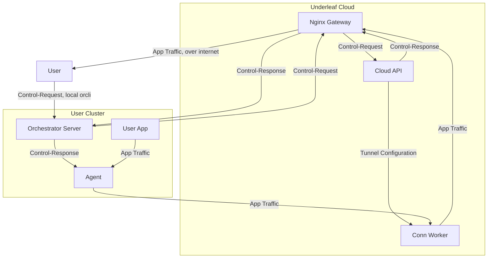
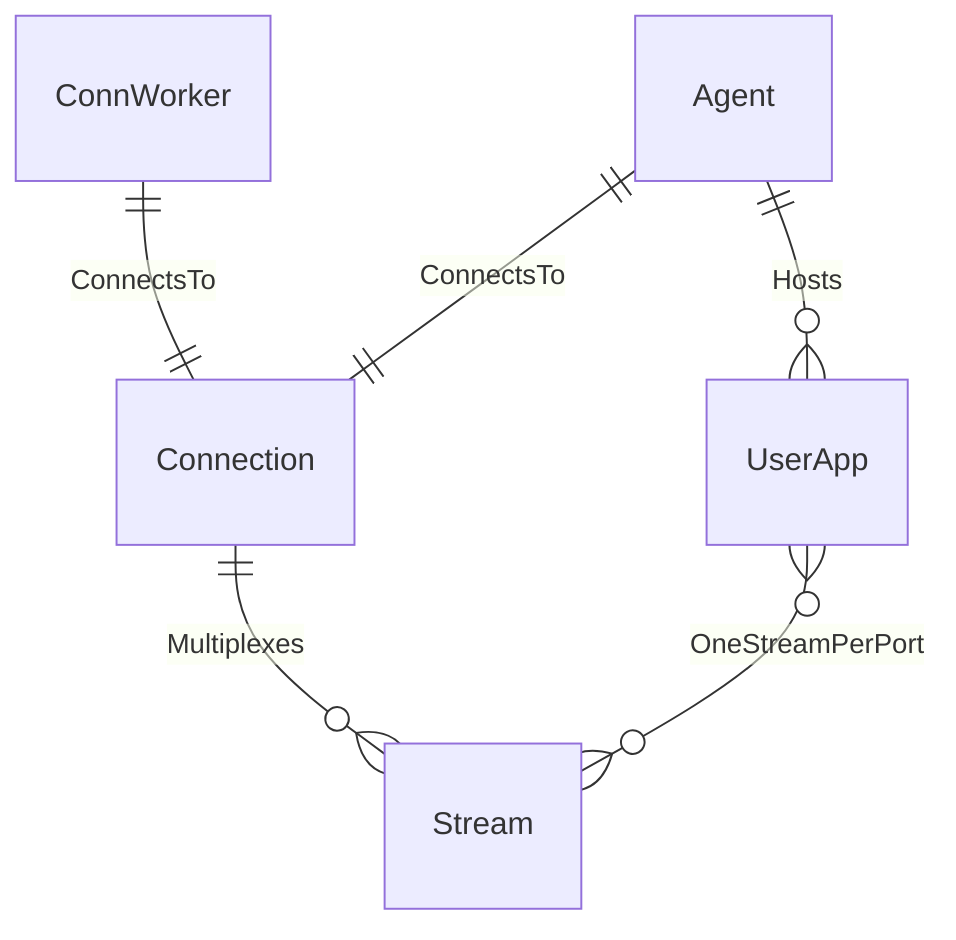

# Conn Worker

## Architecture



## API

### REST API

Intended for use by the Cloud API for management and data display
```yaml
api:
    v1:
        tunnels:
            POST: Create a new tunnel
            GET: List + search tunnels
            {id}:
                GET: Get tunnel
                DELETE: Tear down tunnel
        metrics: # future
            performance:
                GET: performance related metrics
                timeseries:
                    GET: timeseries performance metrics
            tunnels:
                GET: tunnel metrics
                timeseries:
                    GET: timeseries tunnel metrics
                {id}:
                    GET: specific tunnel metrics
```

### gRPC

Intended for use by the agent to establish and manage its connection with the Conn Worker

```proto
BeginConn(BeginConnRequest) returns BeginConnResponse;
TerminateConn(TerminateConnRequest) returns TerminateConnResponse;
```

## Data Model



| Info | Value |
| ---- | ----- |
| Language | Golang |
| Storage | Redis |

| Protocol | Purpose | Location |
| -------- | ------- | -------- |
| gRPC | Agent connection/tunnel management | `:50102` |

## Running locally

```bash
make run
```

Normally run as part of the cloud process group (`cd cloud && make run`, or `make run-conn-worker`) — see the [root README](../../README.md#development). Config is read from `configs/local/conn_worker.yaml` (or `UNDERLEAF_CONFIG` when containerized via [docker-compose.yaml](../../docker-compose.yaml)); requires Redis.

