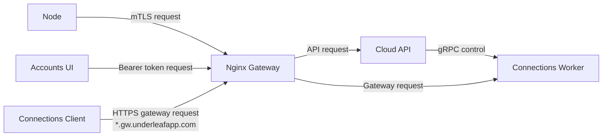
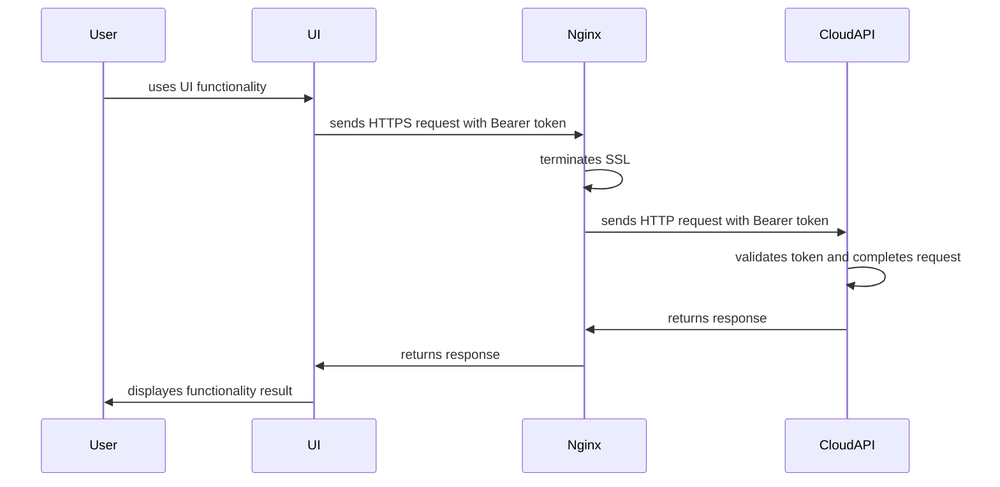
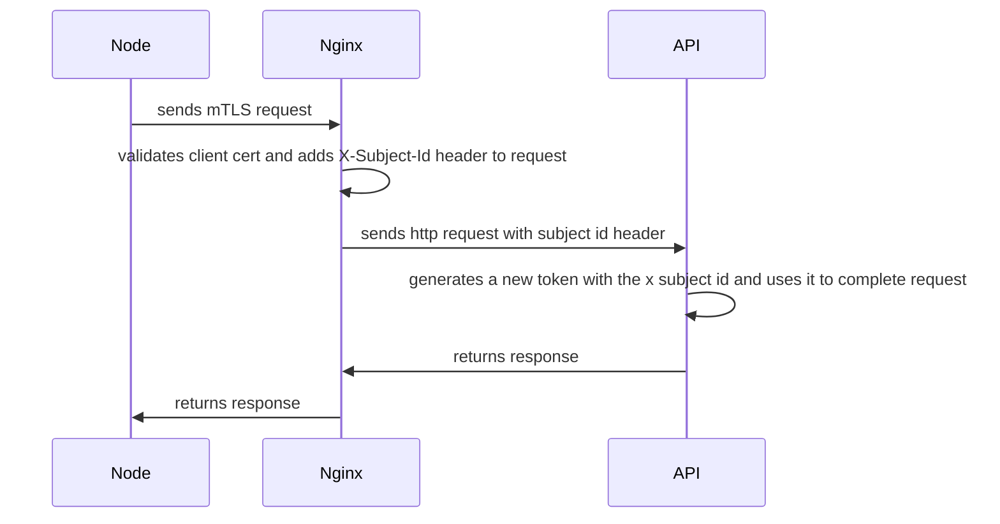
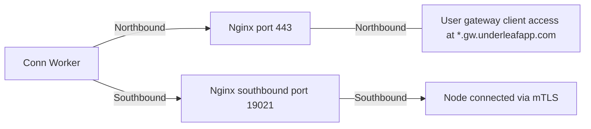
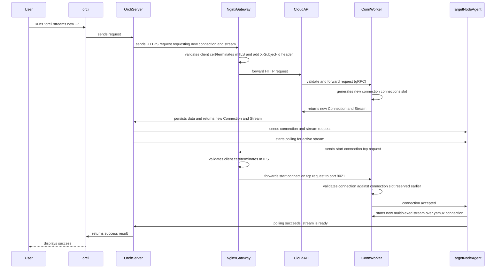
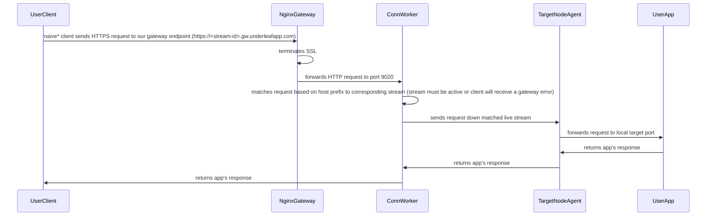

# cloud Nginx

Overview

Components:
- **Node**: a user's compute node (server, PC, Raspberry PI, etc)
- **Accounts UI**:  Our cloud-hosted React UI
- **Nginx gateway**: cloud fronting gatway
- **Cloud API**: Primary API
- **Conn Woker**: Microservice for handling connections and streams
- **Connections Client**: A user client accessing conn worker-hosted endpoints

## Detailed Flows

UI request

Node HTTP + TLS request

**Reference point for the next sequence diagrms**

An example of a gateway connection

Start Stream request (Southbound / node-side)

Join Stream request (Southbound / client-side)

*naive: the user's client has no knowledge of the connection infrastructure--the gateway appears as an HTTP server just as any other, the Underleaf infrastructure should be largely invisible
